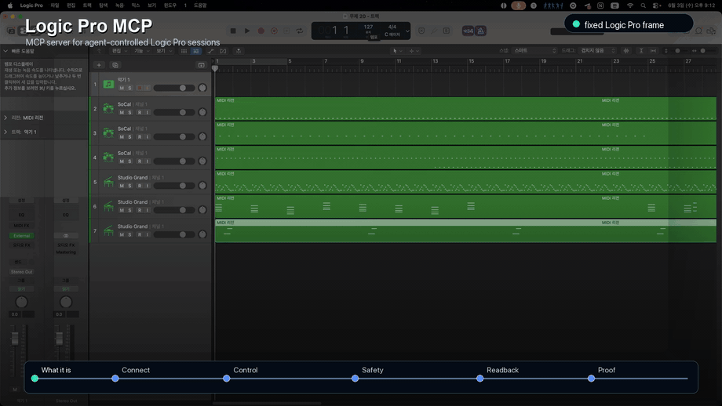
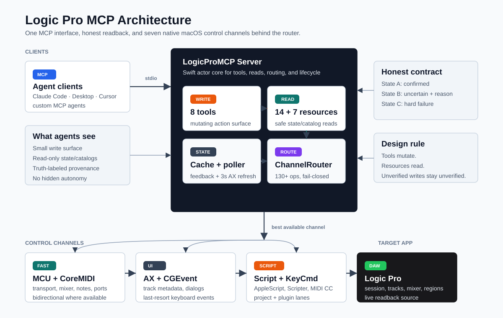

<p align="center">
  
</p>

<p align="center">
  <strong>The missing agent control plane for Logic Pro.</strong><br/>
  A production-oriented MCP server that lets Claude, Cursor, and custom MCP agents operate Logic Pro with state, provenance, and fail-closed safety gates.
</p>

<p align="center">
  <a href="https://swift.org"></a>
  <a href="https://developer.apple.com/macos/"></a>
  <a href="https://modelcontextprotocol.io"></a>
  <a href="LICENSE"></a>
  
  
  <a href="https://github.com/MongLong0214/logic-pro-mcp/stargazers"></a>
</p>

<p align="center">
  <a href="docs/media/logic-pro-mcp-demo.mp4">
    
  </a>
</p>

<p align="center">
  <a href="docs/media/logic-pro-mcp-demo.mp4">18 sec MP4</a> ·
  <a href="docs/media/logic-pro-mcp-thumbnail.png">social thumbnail</a>
</p>

---

Logic Pro does not ship a first-party API for agentic composition, session setup, mixer operations, or live project readback. Logic Pro MCP fills that gap by combining **7 native macOS control channels** behind one MCP interface, then wrapping every high-risk operation in explicit state, confirmation, and verification contracts.

The result is not "screen automation with prompts." It is a structured server for DAW agents: tools mutate, resources read, evidence is labeled, and uncertain outcomes stay uncertain instead of being reported as success.

```
You: "Make a 4-bar techno loop in A minor at 140 BPM"

MCP client → logic_tracks.record_sequence {
  bar: 1, tempo: 140,
  notes: "45,0,95;57,107,95;45,214,95;..."
}
MCP client → logic_tracks.set_instrument {
  index: 0, path: "Electronic Drums/Roland TR-909"
}

Logic Pro MCP: region imported, instrument routed, readback exposed through resources.
```

## At a Glance

| Surface | Current source tree |
|---------|---------------------|
| MCP tools | 8 tools covering transport, tracks, mixer, MIDI, edit, navigation, project lifecycle, and system health |
| Read resources | 14 static resources for live state, project metadata, stock plugin intelligence, and workflow skills |
| Resource templates | 7 templates for track, region, mixer strip, stock plugin, and workflow lookup/search |
| Control channels | MCU, Accessibility, AppleScript, CoreMIDI, CGEvent, Scripter, MIDI Key Commands |
| Verification line | Current source tree: `1256` Swift tests + strict Logic Pro 12.2 live E2E `293 passed / 0 skipped / 0 failed` |
| Published release | `v3.4.6`, ADHOC universal artifacts, SHA256 metadata, macOS 14/15 install validation |

If this project helps you make music with Claude, Cursor, or any MCP client, star the repo. It helps the project reach more Logic Pro users and maintainers.

## Why It Exists

Most Logic Pro automation attempts fall into one of three traps:

1. **Prompt-only recipes** that drift away from the real tool surface.
2. **Keyboard macro automation** that can click the wrong target and still look successful.
3. **Single-channel control** that can write to Logic but cannot reliably read what Logic actually did.

Logic Pro MCP uses a different model. It routes each operation to the strongest available channel, exposes live state through MCP resources, and forces callers to handle three outcomes: confirmed, uncertain, or failed.

## What It Controls

| Area | What agents can do | Safety/readback model |
|------|--------------------|-----------------------|
| Transport | Play, stop, record, locate, cycle, metronome, tempo | CoreMIDI/AX routing with live `logic://transport/state` readback |
| Tracks | Create, delete, duplicate, select, rename, mute, solo, arm, set instruments | Mutating targets require explicit index/name; uncertain selection fails closed before writes |
| MIDI composition | Generate SMF server-side, import MIDI, send notes/CC/MMC, create virtual ports | `.mid` imports are constrained to `/tmp/LogicProMCP/` and must create a live track |
| Mixer | Volume, pan, plugin snapshots, guarded stock plugin insertion | MCU writes plus AX readback/provenance; occupied plugin slots refuse replacement |
| Library | Scan Logic's instrument library and load patches by path | Disk/AX inventory is cached and path-allowlisted |
| Navigation | Bars, markers, zoom, view toggles | Marker navigation is target-faithful; cold-cache misses return failure instead of "next marker" |
| Project lifecycle | New, open, save, save-as, close, bounce, quit | Destructive operations require confirmation; saves verify package existence/mtime |

## Agent-Grade Surfaces

**Tools are for actions.** The public write surface is intentionally small: `logic_transport`, `logic_tracks`, `logic_mixer`, `logic_midi`, `logic_edit`, `logic_navigate`, `logic_project`, and `logic_system`.

**Resources are for state.** Clients should read `logic://transport/state`, `logic://tracks`, `logic://mixer`, `logic://project/info`, `logic://midi/ports`, and related resources instead of burning tool calls on polling.

**Stock plugin intelligence is read-only.** The current source tree adds `logic://stock-plugins`, detail/search/census/capability resources, and a 103-entry documented Logic stock catalog. Entries carry truth labels such as `manifested`, `inferred`, `verified`, `observed`, `unavailable`, and `readback_mismatch`; production discovery never fabricates verification.

**Workflow skills are linted recipes, not hidden autonomy.** The current source tree adds `logic://workflow-skills` with seven validated workflows for project readiness, MIDI sketching, marker planning, gain staging prep, stock plugin planning, guarded Gain insertion, and bounce readiness. Reading a workflow never executes it.

## Trust Model

- **Honest Contract envelopes**: mutating operations return State A confirmed, State B uncertain with a reason, or State C failure with an error.
- **Fail-closed targets**: dangerous mixer, marker, track, MIDI import, and plugin operations require explicit targets and validation.
- **Confirmation levels**: destructive/project and plugin insertion flows require explicit confirmation metadata before execution.
- **Provenance labels**: read surfaces expose source, freshness, and evidence labels instead of forcing clients to guess.
- **Installer hardening**: Homebrew pins SHA256; the shell installer refuses to run without explicit hash/team pins unless same-origin provenance is explicitly allowed.
- **Release honesty**: published `v3.4.6` is the stable install line; the expanded #14/#15 resource surface is source-tree work that requires the next public release line (`v3.5.0`) before redistribution.

## Quick Start

**Prerequisites**: macOS 14+, Logic Pro 12.0.1+, and an MCP client that can launch a stdio server. Published GitHub Actions/Homebrew assets are universal (`arm64` + `x86_64`).

The current published stable release is `v3.4.6` (2026-06-09 KST). It ships ADHOC-signed universal artifacts when Apple Developer ID credentials are absent, plus `SHA256SUMS.txt` and `RELEASE-METADATA.json` for pinned installs.

### 1. Install

```bash
brew tap MongLong0214/logic-pro-mcp https://github.com/MongLong0214/logic-pro-mcp
brew install logic-pro-mcp
```

The Homebrew formula pins both the release tarball URL and its SHA256; Homebrew itself is a trusted delivery channel with its own signature chain. This is the hardened path for production installs.

For source-tree development, build locally:

```bash
git clone https://github.com/MongLong0214/logic-pro-mcp.git
cd logic-pro-mcp
swift build -c release
```

### 2. Register with an MCP client

Claude Code:

```bash
claude mcp add --scope user logic-pro -- LogicProMCP
```

Generic MCP client config:

```json
{
  "mcpServers": {
    "logic-pro": {
      "command": "LogicProMCP"
    }
  }
}
```

If you built from source, point the command at `.build/release/LogicProMCP`.

### 3. Complete Logic Pro setup

Run the local checks:

```bash
LogicProMCP --check-permissions
```

Then complete the two Logic-side setup steps in [docs/SETUP.md](docs/SETUP.md):

- Register the `LogicProMCP-MCU-Internal` MCU control surface.
- Add the bundled Scripter insert if you need plugin-parameter writes.

Logic 12.2+ does not auto-import the legacy Key Commands plist; the bundled preset is staged as a Manual MIDI Learn reference.

### 4. Test from your agent

Ask the client:

> Check Logic Pro MCP health and show all ready channels.

Expected: all 7 channels `ready` after full setup, or 5 if you intentionally skipped Key Commands and Scripter.

### Pinned shell installer

The installer is **fail-closed**: it refuses to run without explicit `LOGIC_PRO_MCP_SHA256` + `LOGIC_PRO_MCP_TEAM_ID` env pins. Inspect the script first, then execute with the pins copied from the release's `SHA256SUMS.txt`:

```bash
curl -fsSL https://raw.githubusercontent.com/MongLong0214/logic-pro-mcp/v3.4.6/Scripts/install.sh -o install.sh
# inspect install.sh, then:
LOGIC_PRO_MCP_SHA256=<paste from release SHA256SUMS.txt> \
LOGIC_PRO_MCP_TEAM_ID=<paste team_id from RELEASE-METADATA.json> \
bash install.sh
```

If you knowingly accept same-origin provenance (hash + Team ID fetched from the same release as the binary), opt in explicitly:

```bash
LOGIC_PRO_MCP_ALLOW_SAME_ORIGIN=1 \
bash <(curl -fsSL https://raw.githubusercontent.com/MongLong0214/logic-pro-mcp/v3.4.6/Scripts/install.sh)
```

See [SECURITY.md §Installer trust model](SECURITY.md#installer-trust-model) for the trust tiers and threat model.

## Architecture at a Glance

<p align="center">
  
</p>

See [Architecture](docs/ARCHITECTURE.md) for channel priorities, state flow, cache freshness, and live E2E topology.

## Documentation

| Document | Audience | Purpose |
|----------|----------|---------|
| [Setup Guide](docs/SETUP.md) | End users | One-page install + Logic Pro integration, ~10 min |
| [API Reference](docs/API.md) | End users, MCP clients | All 8 tools, 14 resources, 7 templates, 130+ operations |
| [Troubleshooting](docs/TROUBLESHOOTING.md) | End users | Common failures and fixes |
| [Architecture](docs/ARCHITECTURE.md) | Contributors | Channel design, state flow, testing strategy |
| [Maintainer Guide](docs/MAINTAINERS.md) | Maintainers | Release, approvals, E2E checklist |
| [Live Verify v3.4.6](docs/live-verify-v3.4.6.md) | Maintainers, QA | Latest deterministic, coverage, release-build, packaging, and carried Logic Pro 12.2 issue-verification evidence |
| [Stock Plugin PRD](docs/prd/PRD-verified-stock-plugin-intelligence.md) | Contributors, client authors | Truth-labeled stock plugin intelligence contract |
| [Workflow Skills PRD](docs/prd/PRD-workflow-skills-pack.md) | Contributors, client authors | Validated workflow-pack contract and evidence levels |
| [Security Policy](SECURITY.md) | Security reviewers | Threat model, reporting, hardening |
| [Changelog](CHANGELOG.md) | Everyone | Per-release changes |
| [Contributing](CONTRIBUTING.md) | Contributors | Dev setup, PR workflow |

## Status

**Published stable**: `v3.4.6` is available as a GitHub Release and Homebrew install. It is the evidence/packaging alignment release after the Logic Pro 12.2 mixer verification work for Issues #10-#13. Release workflow `27186085967` passed build plus macOS 14/15 install validation; published metadata is `team_id:"ADHOC"`, `signing:"adhoc"`, `architectures:["x86_64","arm64"]`.

**Current source tree**: the repo also carries Issue #14 stock plugin intelligence and Issue #15 workflow skills. That expanded public resource surface is documented here and in [docs/API.md](docs/API.md), but it must ship as the next minor release line (`v3.5.0`) before being described as part of the published stable artifact.

## Verification

| Gate | Current evidence |
|------|------------------|
| Static format | `git diff --check origin/main...HEAD` passed on the #14/#15 source integration |
| Full deterministic suite | `swift test --no-parallel` -> `1256` passed, `0` failed |
| Release build | `swift build -c release` passed |
| Python E2E syntax | `python3 -m py_compile Scripts/live-e2e-test.py` passed |
| Strict live Logic Pro 12.2 | `LOGIC_PRO_MCP_STRICT_LIVE=1 Scripts/live-e2e-test.sh` run 3x -> `879` total passed, `0` skipped, `0` failed |
| Current integrated live pass | #14 + #15 source integration -> `293` passed, `0` skipped, `0` failed |
| v3.4.6 release evidence | [docs/live-verify-v3.4.6.md](docs/live-verify-v3.4.6.md) |
| #14 evidence | [docs/tickets/issue14-verified-stock-plugin-intelligence/VERIFICATION-2026-06-10.md](docs/tickets/issue14-verified-stock-plugin-intelligence/VERIFICATION-2026-06-10.md) |
| #15 evidence | [docs/tickets/issue15-workflow-skills-pack/VERIFICATION-2026-06-10.md](docs/tickets/issue15-workflow-skills-pack/VERIFICATION-2026-06-10.md) |

Live E2E defaults to the release binary. Protocol/security assertions run on any host; Logic/CoreMIDI-dependent checks skip unless a real Logic Pro session is visible. Strict mode converts those skips to failures and launches the MCP server under a trusted shell/tmux parent so macOS TCC evaluates the same parent context used by live client flows.

## API Contracts That Matter

- **Honest Contract envelope** — every mutating op returns State A confirmed, State B uncertain with `reason`, or State C hard failure with `error`. See [docs/HONEST-CONTRACT.md](docs/HONEST-CONTRACT.md).
- **Fail-closed mutation targets** — mixer faders, plugin params, marker delete/rename, track delete/duplicate, and MIDI imports require explicit target parameters.
- **Target-faithful navigation** — `goto_marker` returns `element_not_found` on a cold cache instead of advancing to the next marker.
- **1-based MIDI channel** — `send_note`, `send_cc`, and `record_sequence` `ch` values accept 1..16 to match Logic's UI.
- **Audit phase split** — audit logs distinguish rejected calls, confirmation prompts, and executed route invocations.
- **Verified project saves** — `project.save_as` verifies the target `.logicx` package exists and that existing packages advance modification time.
- **Live project metadata** — `logic://project/info` promotes live transport tempo/sample-rate when available and falls back per-field to saved project metadata.
- **Read-only catalogs** — stock plugin and workflow resources are discovery/planning surfaces; they do not mutate Logic.

## Release & Distribution

Stable production tags use the GitHub Actions release workflow. `RELEASE-METADATA.json` records the exact signing mode, Team ID, and architectures for each artifact. When Developer ID credentials are absent, releases publish ADHOC artifacts with SHA256 metadata and install validation rather than pretending to be notarized.

Per-release detail lives in [CHANGELOG.md](CHANGELOG.md). Security and installer trust tiers are documented in [SECURITY.md](SECURITY.md).

## Known Limitations

- **Tempo typing**: `transport.set_tempo` falls back to slider increments when Logic's tempo display cannot accept text input; sub-10-BPM precision may require setting tempo manually once in Logic.
- **MIDI region padding**: `record_sequence` regions start at bar 1 and extend to the target bar using inaudible padding; note timing inside the region is exact, but the region can look longer than the phrase.
- **MIDI Key Commands**: Logic 12.2 does not accept the legacy `.plist` Key Commands import; manual MIDI Learn remains required for keycmd-only operations.
- **Markers**: `logic://markers` returns `[]` honestly when the Marker List window is closed on Logic 12.2; auto-opening that window is not shipped because it changes focus.
- **Plugin parameter readback**: guarded stock plugin insertion is live-verified, but arbitrary per-parameter plugin readback remains future work.
- **Stock plugin catalog**: production census can produce `manifested` and `inferred`; `verified`, `observed`, `unavailable`, and `readback_mismatch` require explicit live-census evidence.
- **Workflow skills**: workflow resources guide clients through checked recipes. They do not execute workflows or bypass existing confirmation gates.

## Development

```bash
swift test --no-parallel
swift build -c release
python3 -m py_compile Scripts/live-e2e-test.py
```

For live attestation on a configured Logic Pro host:

```bash
LOGIC_PRO_MCP_STRICT_LIVE=1 Scripts/live-e2e-test.sh
```

## License

MIT. See [LICENSE](LICENSE).

## Contributing

Bug reports, PRs, and feature discussions are welcome. See [CONTRIBUTING.md](CONTRIBUTING.md) for the dev workflow.

Security vulnerabilities: please do **not** open a public issue. See [SECURITY.md](SECURITY.md) for the private disclosure process.
