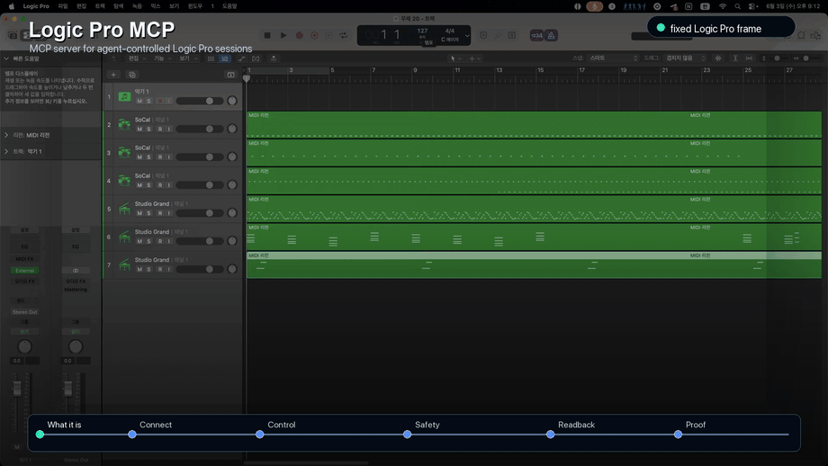

# Logic Pro MCP Server for Claude, Cursor, and AI Agents

[](https://mcptoplist.com/server/io.github.MongLong0214%2Flogic-pro-mcp)

A local Model Context Protocol (MCP) server that lets Claude Code, Claude Desktop, Cursor, Codex, VS Code, and other MCP clients control Logic Pro for AI music production: create tracks, write MIDI, operate transport and mixer state, inspect live project data, and verify results.

[Install](#1-install) · [Watch demo](docs/media/logic-pro-mcp-demo.mp4) · [What it controls](#what-it-controls)

> ### 🏆 Selected for Anthropic's [Claude for Open Source](https://claude.com/contact-sales/claude-for-oss) program
> Logic Pro MCP has been **officially selected for Anthropic's Claude for Open Source program** — recognition from the makers of Claude that this project is open-source work worth supporting. This server is built with Claude, for Claude-powered agents — and is now officially supported by the program.

<p align="center">
  
</p>

<p align="center">
  <a href="https://claude.com/contact-sales/claude-for-oss"></a>
  <a href="https://swift.org"></a>
  <a href="https://developer.apple.com/macos/"></a>
  <a href="https://modelcontextprotocol.io"></a>
  <a href="https://github.com/MongLong0214/logic-pro-mcp/actions/workflows/ci.yml"></a>
  <a href="LICENSE"></a>
  
</p>

<p align="center">
  <a href="docs/media/logic-pro-mcp-demo.mp4">
    
  </a>
</p>

<p align="center">
  An 82 BPM D-minor lofi loop composed live in Logic Pro 12.3 by the MCP — tempo, three MIDI parts, a Drummer, and playback, all from prompts.<br/>
  <a href="docs/media/logic-pro-mcp-demo.mp4">▶ Watch the 36-sec demo (with sound)</a>
</p>

---

Logic Pro MCP Server gives Claude, Cursor, Codex, and other MCP clients a structured way to control Logic Pro without brittle keyboard macros. Logic Pro does not ship a first-party API for agentic composition, session setup, mixer operations, or live project readback, so Logic Pro MCP fills that gap by combining **7 native macOS control channels** (CoreMIDI, Accessibility, AppleScript, CGEvent, MCU, Scripter, MIDI Key Commands — `Sources/LogicProMCP/Channels/Channel.swift`) behind one MCP interface, then wrapping every high-risk operation in explicit state, confirmation, and verification contracts.

The result is not "screen automation with prompts." It is a structured server for DAW agents: tools mutate, resources read, evidence is labeled, and uncertain outcomes stay uncertain instead of being reported as success.

```
You: "Make a 4-bar techno loop in A minor at 140 BPM"

MCP client → logic_tracks.record_sequence {
  bar: 1, tempo: 140,
  notes: "45,0,95;57,107,95;45,214,95;..."
}
MCP client → logic_tracks.set_instrument {
  index: 0, path: "Electronic Drums/Roland TR-909"
}

Logic Pro MCP: region imported, instrument routed, readback exposed through resources.
```

## At a Glance

Counts below are read from the current source tree with the command shown; re-run it after pulling to reproduce.

| Surface | Current source tree | Command |
|---------|---------------------|---------|
| MCP tools | 10 tools — `logic_transport`, `logic_tracks`, `logic_mixer`, `logic_midi`, `logic_edit`, `logic_navigate`, `logic_project`, `logic_audio`, `logic_system`, `logic_plugins` | `grep -c '^        toolWithOutputSchema' Sources/LogicProMCP/Server/LogicProServer.swift` |
| Read resources | 18 static resources — health, transport, tracks, mixer, markers, project info/audit/cleanup-plan, MIDI ports, MCU state, library inventory, stock plugins/census/capabilities, stock instruments, Session Players, workflow skills/schema | `awk '/private static let baseResources/,/^\]/' Sources/LogicProMCP/Resources/ResourceProvider.swift \| grep -c 'uri:'` |
| Resource templates | 12 templates — operation catalog, track, region, mixer-strip, stock plugin detail/search, stock instrument detail/search, Session Player detail, session-plan dry run, workflow detail/search | `awk '/private static let baseTemplates/,/^\]/' Sources/LogicProMCP/Resources/ResourceProvider.swift \| grep -c 'uriTemplate:'` |
| Control channels | **7** — CoreMIDI, Accessibility, CGEvent, AppleScript, MCU, MIDIKeyCommands, Scripter | `grep -n 'case .* = "' Sources/LogicProMCP/Channels/Channel.swift` |
| Locales Logic ships | **10** — de-DE en-US es-ES fr-FR it-IT ja-JP ko-KR pt-BR zh-CN zh-TW | `python3 -c "import json; print(json.load(open('docs/locale/ui-labels.json'))['supported_locales'])"` |
| Supported Logic Pro | **Latest Logic Pro first** — desktop **Logic Pro** (`com.apple.logic10`, `/Applications/Logic Pro.app`) and Apple Creator Studio **Logic Pro Creator Studio** (`com.apple.mobilelogic`, `/Applications/Logic Pro Creator Studio.app`). Desktop **Logic Pro** is the only variant the release qualification matrix covers (`shipVariants = [.desktop]`), so it is the only one this server claims to control. Creator Studio's bundle ID is recognised so that a machine with both installed is not targeted by accident and so the server can say which one it found — recognising a variant is not the same as qualifying it, and no qualification evidence exists for Creator Studio. Set `LOGIC_PRO_BUNDLE_ID` to pin the desktop variant when both are installed. Logic Pro 12.3 is the actively-validated target (macOS 15.6+); older versions down to the 12.0.1 floor are best-effort |
| Release state | **Current stable**: `v3.18.0` — [v3.18.0](https://github.com/MongLong0214/logic-pro-mcp/releases/tag/v3.18.0) |

If this project helps you make music with Claude, Cursor, Codex, or any MCP client, star the repo. It helps the project reach more Logic Pro users and maintainers.

Want to contribute? Start with the [Contributing Guide](CONTRIBUTING.md) and the [open issues](https://github.com/MongLong0214/logic-pro-mcp/issues?q=is%3Aissue%20is%3Aopen). Many docs, examples, validation tests, and CLI-message improvements do not require Logic Pro.

## Why It Exists

Most Logic Pro automation attempts fall into one of three traps:

1. **Prompt-only recipes** that drift away from the real tool surface.
2. **Keyboard macro automation** that can click the wrong target and still look successful.
3. **Single-channel control** that can write to Logic but cannot reliably read what Logic actually did.

Logic Pro MCP uses a different model. It routes each operation to the strongest available channel, exposes live state through MCP resources, and forces callers to handle three outcomes: confirmed, uncertain, or failed.

## What It Controls

| Area | What agents can do | Safety/readback model |
|------|--------------------|-----------------------|
| Transport | Play, stop, record, locate, cycle, metronome, tempo | CoreMIDI/AX routing with live `logic://transport/state` readback |
| Tracks | Create, delete, duplicate, select, rename, mute, solo, arm, set instruments | Mutating targets require explicit index/name; uncertain selection fails closed before writes |
| MIDI composition | Generate SMF server-side, import MIDI, send notes/CC/MMC, create virtual ports | `.mid` imports are constrained to server-managed temp files and must create a live track |
| Mixer | Volume, pan, plugin snapshots, guarded stock plugin insertion, MCU-driven fader bank walk | AX writes with same-surface readback for volume/pan; MCU writes verify by LCD upper-row redraw; occupied plugin slots refuse replacement |
| Library | Scan Logic's instrument library and load patches by path | Disk/AX inventory is cached; disk scan dedupes user/app-bundle `.patch` candidates and `resolve_path` classifies kind/source/loadable before `set_instrument` |
| Navigation | Bars, markers, zoom, view toggles | Marker navigation is target-faithful; cold-cache misses return failure instead of "next marker" |
| Project lifecycle | New, open, save, save-as, close, bounce, export plan, quit; cache-only session-population report | Destructive operations require confirmation; dry-run export plans do not open Logic or write artifacts |

## Agent-Grade Surfaces

**Tools are for actions and local artifact checks.** The public write surface is intentionally small: `logic_transport`, `logic_tracks`, `logic_mixer`, `logic_plugins`, `logic_midi`, `logic_edit`, `logic_navigate`, `logic_project`, and `logic_system`. `logic_audio` is read-only and verifies exported files after Logic writes them.

**Resources are for state.** Clients should read `logic://transport/state`, `logic://tracks`, `logic://mixer`, `logic://project/info`, `logic://project/audit`, `logic://project/cleanup-plan`, `logic://midi/ports`, and related resources instead of burning tool calls on polling.

**Evidence is separated from claims.** The README points to release evidence, current-main verification, and live media artifacts instead of implying that a successful command equals a verified Logic state.

## Trust Model

- **Honest Contract envelopes**: mutating operations return State A confirmed, State B uncertain with a reason, or State C failure with an error.
- **Verified plugin apply-back**: `logic_plugins.*` uses HC v2 (`hc_schema: 2`) and returns State A only after project identity, target track, physical insert slot, plugin identity, and readback all agree.
- **Fail-closed targets**: dangerous mixer, marker, track, MIDI import, and plugin operations require explicit targets and validation.
- **Confirmation levels**: destructive/project and plugin insertion flows require explicit confirmation metadata before execution.
- **Provenance labels**: read surfaces expose source, freshness, and evidence labels instead of forcing clients to guess.
- **Installer hardening**: Homebrew pins SHA256; the shell installer refuses to run without explicit hash/team pins unless same-origin provenance is explicitly allowed.
- **Release honesty**: `v3.18.0` is the current stable line, and README claims stay tied to shipped artifacts, release-tree tests, or explicitly linked live evidence.

## Locales

Logic Pro ships ten UI locales, and this server tracks all ten as the default scope (not just en/ko): `de-DE`, `en-US`, `es-ES`, `fr-FR`, `it-IT`, `ja-JP`, `ko-KR`, `pt-BR`, `zh-CN`, `zh-TW`. UI-string matching (menu items, header labels, dialog buttons) lives in [`docs/locale/ui-labels.json`](docs/locale/ui-labels.json), the canon index every locale-sensitive locator derives from.

Each of the 203 canon labels carries a per-locale `coverage`: `measured` (read from a live, running Logic window and recorded with the host, date, and AX role/attribute), `derived` (computed from Apple's own `.strings` tables by `Scripts/derive_label_variants.py`, not read from a live window), `unmeasured`, or `retired` (one label, `headerPanHint`, superseded by `sliderPanHint` and kept in the canon with its reason). Measured counts per locale, out of 203 canon labels (`python3 -c "import json,collections; d=json.load(open('docs/locale/ui-labels.json')); c=collections.Counter(); [c.update([(l,v) for l,v in e['coverage'].items() if v=='measured']) for e in d['labels'].values()]; print(c)"`):

| Locale | Measured | Derived | Unmeasured | Retired |
|--------|----------|---------|------------|---------|
| en-US | 45 | 156 | 1 | 1 |
| ko-KR | 50 | 147 | 5 | 1 |
| ja-JP | 37 | 154 | 11 | 1 |
| de-DE | 44 | 144 | 14 | 1 |
| es-ES | 7 | 177 | 18 | 1 |
| fr-FR | 6 | 175 | 21 | 1 |
| it-IT | 6 | 175 | 21 | 1 |
| pt-BR | 5 | 178 | 19 | 1 |
| zh-CN | 7 | 169 | 26 | 1 |
| zh-TW | 6 | 166 | 30 | 1 |

A `derived` label has not been read from a running Logic in that locale; it is Apple's own string for that key, which is a strong signal but not a live observation. The roadmap ([`docs/roadmap/README.md`](docs/roadmap/README.md)) tracks per-feature live locale campaigns (mixer routing graph, MCU bank walk, record-arm key-command setup, and others) as they are driven against real Logic sessions in each language.

## Quick Start

**Prerequisites**: macOS 14+ for the MCP server, Logic Pro (latest release prioritized — currently **12.3**, which Apple lists as requiring macOS 15.6+; older Logic versions down to the 12.0.1 floor are best-effort), and an MCP client that can launch a stdio server. Published GitHub Actions/Homebrew assets are universal (`arm64` + `x86_64`) and do not require Xcode. Bounce/export uses the bundled native CGEvent helper with no third-party click binary.

> **Logic Pro version policy.** Logic Pro MCP tracks the **latest Logic Pro release as its first-class target** and validates against it. When Apple ships a new Logic Pro version, supporting it is the top priority — the Accessibility/UI tree shifts between releases, so the newest version is where fixes land first. Older versions above the 12.0.1 floor remain best-effort and may lose parity as those UI surfaces change.

The package manifest uses Swift tools 6.0 for compatibility. Current source verification uses Xcode 16.4 / Swift 6.2 in CI.

The current stable line is `v3.18.0` (cut 2026-09-28 UTC). Its per-release detail — everything added, changed, and fixed since `v3.17.0`, along with every stated limit — is in [CHANGELOG.md](CHANGELOG.md); this README does not restate release history.

### 1. Install

```bash
brew tap MongLong0214/logic-pro-mcp https://github.com/MongLong0214/logic-pro-mcp
brew trust monglong0214/logic-pro-mcp   # Homebrew 6.0+ requires trusting third-party taps
brew install logic-pro-mcp
```

The Homebrew formula pins both the release tarball URL and its SHA256; Homebrew itself is a trusted delivery channel with its own signature chain. This is the hardened path for production installs. (On Homebrew older than 6.0 the `brew trust` step does not exist — skip it.)

For source-tree development, build locally:

```bash
git clone https://github.com/MongLong0214/logic-pro-mcp.git
cd logic-pro-mcp
swift build -c release
```

To upgrade an existing install: Homebrew installs use `brew update && brew upgrade logic-pro-mcp`; source builds use `git pull && swift build -c release`; pinned shell-installer installs re-run the installer with the new release's pins (below). Because release binaries are ad-hoc signed (no Apple Developer ID; see [SECURITY.md](SECURITY.md#release-signing)), macOS treats each new build as a different signed identity — **Accessibility and Automation grants do not carry over to a freshly built or reinstalled binary**, and TCC re-approval for the launcher app is expected after every upgrade, not just after long gaps ([docs/TROUBLESHOOTING.md](docs/TROUBLESHOOTING.md) covers removing stale TCC entries and re-granting them).

### 2. Register with an MCP client

Claude Code:

```bash
claude mcp add --scope user logic-pro -- LogicProMCP
```

Generic MCP client config (Claude Desktop, Cursor, VS Code, Codex CLI, Codex Desktop, and any other client that accepts a stdio MCP server entry — each client's own config file location and key names are documented by that client, not here):

```json
{
  "mcpServers": {
    "logic-pro": {
      "command": "LogicProMCP"
    }
  }
}
```

If you built from source, point the command at `.build/release/LogicProMCP`.

### 3. Complete Logic Pro setup

Run the local checks:

```bash
LogicProMCP --check-permissions
```

Then complete the two Logic-side setup steps in [docs/SETUP.md](docs/SETUP.md):

- Register the `LogicProMCP-MCU-Internal` MCU control surface.
- Add the bundled Scripter insert if you need plugin-parameter writes.

Logic 12.2+ does not auto-import the legacy Key Commands plist; the bundled preset is staged as a Manual MIDI Learn reference.

### 4. Test from your agent

Ask the client:

> Check Logic Pro MCP health and show all ready channels.

Expected: all 7 channels `ready` after full setup, or 5 if you intentionally skipped Key Commands and Scripter.

### Pinned shell installer

The installer is **fail-closed**: it refuses to run without explicit `LOGIC_PRO_MCP_SHA256` + `LOGIC_PRO_MCP_TEAM_ID` env pins. It verifies the downloaded `LogicProMCP-macOS-universal.tar.gz` archive, so copy the SHA from that archive entry in the release's `SHA256SUMS.txt`:

```bash
curl -fsSL https://raw.githubusercontent.com/MongLong0214/logic-pro-mcp/v3.18.0/Scripts/install.sh -o install.sh
# inspect install.sh, then:
LOGIC_PRO_MCP_SHA256=<paste LogicProMCP-macOS-universal.tar.gz SHA256SUMS entry> \
LOGIC_PRO_MCP_TEAM_ID=<paste team_id from RELEASE-METADATA.json> \
bash install.sh
```

If you knowingly accept same-origin provenance (hash + Team ID fetched from the same release as the binary), opt in explicitly:

```bash
LOGIC_PRO_MCP_ALLOW_SAME_ORIGIN=1 \
bash <(curl -fsSL https://raw.githubusercontent.com/MongLong0214/logic-pro-mcp/v3.18.0/Scripts/install.sh)
```

See [SECURITY.md §Installer trust model](SECURITY.md#installer-trust-model) for the trust tiers and threat model.

## Permissions

Open **System Settings -> Privacy & Security**:

1. **Accessibility**: enable the app that launches `LogicProMCP` (Claude Code, Terminal, Cursor, Codex, or Claude Desktop).
2. **Automation**: allow that app to control **Logic Pro** and, separately, **System Events** — macOS treats these as two distinct grants, and granting Logic Pro does not imply System Events.

If you use **Apple Creator Studio** Logic Pro (`com.apple.mobilelogic`), grant Automation separately from desktop Logic Pro (`com.apple.logic10`); macOS treats them as distinct apps even though both appear as "Logic Pro" in some pickers.

`--check-permissions` and `LogicProMCP doctor` report each grant as a three-state value (`granted` / `not_granted` / `not_verifiable`, never a bare Bool) and cover: **Accessibility**, **Automation → Logic Pro**, **Automation → System Events**, and **PostEvent** (Input Monitoring, needed by the CGEvent bounce/click fallback).

```bash
LogicProMCP --check-permissions
LogicProMCP doctor
```

Because release binaries are ad-hoc signed, every new build or reinstall is a new signed identity to macOS: expect to re-grant Accessibility/Automation after upgrading, not only on first install. If permissions look wrong after reinstalling, remove the stale TCC entries in System Settings and grant them again to the actual launcher app ([docs/TROUBLESHOOTING.md](docs/TROUBLESHOOTING.md)).

### Forcing a Logic Pro variant

```bash
LOGIC_PRO_BUNDLE_ID=com.apple.logic10 LogicProMCP
```

Valid values: `com.apple.logic10` (desktop) and `com.apple.mobilelogic` (Creator Studio). Only desktop Logic Pro is qualified for this release. Forcing `com.apple.mobilelogic` points the server at Creator Studio anyway, with no qualification evidence behind it, and on a machine where Creator Studio is the only Logic installed, `LogicProMCP doctor` fails `logic.installation` with reason `unshipped_variant_only`.

## Using LogicProMCP as a library

The package also exposes the `LogicProMCP` target as a library product named `LogicProMCPKit` (since v3.17.0), so a Swift application can link the same code the server runs instead of driving the server as a separate stdio process.

The public surface is small and deliberate. Almost all of the module, including the Accessibility readers (`AXLogicProElements`, `AXHelpers`, `AccessibilityChannel`), the channels, the state cache, and the dispatchers, is `internal` and is not reachable through the library. What is public:

- `PluginInspector` (in `Accessibility/PluginInspector.swift`): the plug-in window Setting-menu inspector. Static entry points `enumerateMenuTree`, `parsePath`, `encodePath`, `resolveMenuPath`, `selectMenuPath`, `decodeAUVersion`, `findPluginWindow`, `identifyPlugin`, `openPluginWindow`, and `closePluginWindow`. Every entry point that touches a window or a menu takes a caller-supplied `PluginPresetProbe` or `PluginWindowRuntime` of closures; the module ships no public production runtime, so nothing here reaches Logic on its own.
- The data types those entry points use: `PluginPresetNodeKind`, `PluginPresetNode`, `PluginPresetCache`, `PluginPresetInventory`, `MenuHop`, `PluginMenuItemInfo`, `ScannerWindowRecord`, `PluginPresetProbe`, `PluginWindowRuntime`, `PluginError`, `AXUIElementSendable`, and the constant `maxPluginMenuDepth`.
- `AXPluginInstanceIdentity` (in `Accessibility/AXPluginInstanceIdentity.swift`, #972): a read-only census for plug-in hosts. `census(pluginName:identifierPrefix:)` returns an `AXSnapshot` of the Mixer strips whose insert slot names the plug-in (ordinal, name, slot positions) and of the open plug-in editor windows (title, and the first `kAXIdentifier` under the given prefix), plus `Diagnostics` saying what was found. It issues no actions. Three outcomes are distinguishable: an empty snapshot with a note, a partial strip read (`stripsReadWhole` is false, so ordinals are not trustworthy), and a failed editor-window read, which throws `CensusError.windowsReadFailed` instead of returning zero windows. The #972 measurement was on Logic Pro 12.3.1 with the Mixer docked in the main window (X).
- The Library inventory data model (in `Accessibility/LibraryAccessor.swift`): `LibraryNodeKind`, `LibraryNode`, `LibraryRoot`, and `TreeProbe`. The `LibraryAccessor` enum that scans and selects patches is `internal`, so only its data model is reachable.

### Dependency setup

```swift
// Package.swift
dependencies: [
    .package(url: "https://github.com/MongLong0214/logic-pro-mcp", from: "3.17.0"),
],
targets: [
    .target(
        name: "YourTarget",
        dependencies: [.product(name: "LogicProMCPKit", package: "logic-pro-mcp")]
    ),
]
```

```swift
import LogicProMCP
```

The product name is `LogicProMCPKit`; the module you import is `LogicProMCP`. `from: "3.17.0"` is the floor that guarantees the product — every tag before it predates it.

## Setup Doctor

Getting an agent to reliably drive Logic Pro is mostly a permissions-and-environment problem: TCC grants, the right Logic version, a live document, a registered control surface, no blocking modal. `LogicProMCP doctor` is a first-class, **intent-aware readiness platform** built for exactly this — not a boolean "is it installed" check, but a diagnostic that tells you *which capabilities are ready, which are blocked, why, and what to do next* — and never reports green for something it could not actually verify.

```bash
LogicProMCP doctor                 # human-readable report, color when a TTY
LogicProMCP doctor --json          # stable machine contract (schema logic_pro_mcp_doctor.v4)
LogicProMCP doctor --strict        # exit code encodes overall status (CI gate)
LogicProMCP doctor --profile core --client claude-desktop
LogicProMCP doctor --check-updates # opt-in: also checks for a newer release
```

**Intent-aware profiles.** You are not forced through checks you'll never use. `--profile` scopes the required set to how you actually drive Logic — `core` (transport/tracks/AX), `mixer`, `keycmd`, `legacy-scripter`, or `full`. `--client` (`claude-code`, `claude-desktop`, `cursor`, `vscode`, `terminal`, `custom`) adds the registration checks that matter for that host. Aggregate status is scoped to the *selected* profile's required checks, so an MCU-only workflow isn't marked unhealthy for a Scripter gap it will never hit.

**Capability readiness, not just check pass/fail.** Every check is mapped to the capabilities it gates (`track_management`, `midi_import`, `mixer_ax`, `mixer_mcu`, `keycmd_only_ops`, `verified_plugin_applyback`, `project_lifecycle`, …). The report tells you *"MIDI import is ready; verified-plugin apply-back is blocked by PostEvent"* — the language an agent (or an operator) can act on directly.

**Causal chain — `fix_plan` and `blocked_by`.** Failures are ordered into a `fix_plan` (the next actions, most-unblocking first), and each downstream check names the upstream check that `blocked_by` it — so you fix the root, not the symptom. The `headline` restates the single next action.

**Honesty is the whole point.** A check that could not run (missing capability, unreadable TCC db) is reported as an explicit `skipped` with a reason — it is never silently folded into a pass. Intentional skips (`--skip-channel <MIDIKeyCommands|Scripter>` with an optional `--skip-note`, e.g. you deliberately didn't register Scripter) are recorded and excluded from readiness without faking green. TCC findings are redacted to service/principal/state summaries — no raw local paths in the report.

**Strict exit codes** (`--strict`, for CI/agent gating): `0` ok · `1` failed · `2` manual_action_required · `3` degraded. Codes `2`/`3` are status codes, not usage errors, and sit below the `sysexits.h` range.

A real (redacted) run on a box mid-setup:

```jsonc
{
  "schema": "logic_pro_mcp_doctor.v4",
  "doctor_profile": "core",
  "status": "failed",
  "headline": "Next action [permissions.accessibility]: Accessibility permission is not granted",
  "fix_plan": ["permissions.accessibility", "permissions.post_event_access", "install.binary_inventory"],
  "summary": { "total": 26, "passed": 15, "warnings": 1, "failed": 2, "skipped": 8, "manual": 0, "duration_ms": 333 },
  "checks": [ { "id": "binary.path", "status": "pass", "category": "installation", "severity": "info" } /* … */ ]
}
```

The same run in a terminal prints a grouped, color-coded report with per-check remediation anchors into [docs/SETUP.md](docs/SETUP.md). Full flag reference and every check's remediation live in [docs/SETUP.md](docs/SETUP.md#setup-doctor); the `--json` bytes are a stable contract you can assert against in your own onboarding automation.

## Architecture at a Glance

MCP clients launch the Swift stdio server. Dispatchers validate tool parameters, `ChannelRouter` chooses the strongest available macOS channel, resources expose cached/live state, and high-risk writes return explicit confirmed/uncertain/failed envelopes. The core channels are MCU, Accessibility, AppleScript, CoreMIDI, CGEvent, Scripter, and MIDI Key Commands.

## Documentation

| Document | Audience | Purpose |
|----------|----------|---------|
| [Setup Guide](docs/SETUP.md) | End users | Install, MCP registration, Logic Pro integration, doctor anchors |
| [API Reference](docs/API.md) | End users, MCP clients | All 10 tools, 18 resources, 12 templates, Honest Contract, verified apply-back |
| [Troubleshooting](docs/TROUBLESHOOTING.md) | End users | Common failures and fixes |
| [Security Policy](SECURITY.md) | Security reviewers | Threat model, reporting, hardening |
| [Changelog](CHANGELOG.md) | Everyone | Per-release changes |
| [Contributing](CONTRIBUTING.md) | Contributors | Dev setup, scoped PR workflow, PR verification |

The public docs tree is intentionally scoped: setup, API, troubleshooting, README media, plus public issue PRDs/tickets that explain active or shipped user-visible remediation. Historical release notes, internal PRDs, private ticket boards, spike notes, and local live-evidence work files are kept out of `docs/`; public release history belongs in [CHANGELOG.md](CHANGELOG.md), GitHub Releases, merged PRs, and issue history.

## Verification

| Gate | What it checks | Evidence |
|------|-----------------|----------|
| CI (every push/PR) | Full deterministic test suite, release build, repo guards | [Actions](https://github.com/MongLong0214/logic-pro-mcp/actions/workflows/ci.yml) badge above reflects the current `main` head |
| Release build | `swift build -c release` | Runs in CI and in the release workflow |
| Live E2E | Registered operations against a real, running Logic Pro session with independent readback | Per-release evidence and dated observation records under `docs/observations/`, linked from the relevant CHANGELOG entries; not run for every commit |
| README media | Actual Logic Pro screen-capture derivatives | Published under `docs/media/` |

This README does not carry a fixed test-passing count: the suite's size changes every release, and a number here would go stale before the next one. Run `swift test --no-parallel` locally, or read the CI badge, for the current pass/fail state. Per-feature live-evidence claims (which locale, which Logic build, what was measured and what was not) live in [CHANGELOG.md](CHANGELOG.md) next to the change they support, not here.

Live E2E defaults to the release binary. Protocol/security assertions run on any host; Logic/CoreMIDI-dependent checks skip unless a real Logic Pro session is visible.

## API Contracts That Matter

- **Honest Contract envelope** — every mutating op returns State A confirmed, State B uncertain with `reason`, or State C hard failure with `error`. See [docs/API.md](docs/API.md).
- **HC v2 plugin apply-back** — `logic_plugins.get_inventory`, `set_param_verified`, and `insert_verified` add `state` + `hc_schema: 2`; State C always carries `verified:false`, `write_attempted`, retry safety, and target identity where relevant.
- **Fail-closed mutation targets** — mixer faders, plugin params, marker delete/rename, track delete/duplicate, and MIDI imports require explicit target parameters.
- **Exact-slot plugin insertion** — `logic_plugins.insert_verified` targets the physical insert index returned by `get_inventory`, verifies the popup is anchored to that slot, and confirms success only by post-write inventory diff.
- **Target-faithful navigation** — `goto_marker` returns `element_not_found` on a cold cache instead of advancing to the next marker.
- **1-based MIDI channel** — `send_note`, `send_cc`, and `record_sequence` `ch` values accept 1..16 to match Logic's UI.
- **Bounded raw SysEx** — `send_sysex` rejects payloads over 1024 bytes before CoreMIDI routing.
- **Audible-bounce guardrails** — `record_sequence` refuses unverified GM Device / External MIDI imports, `logic://project/audit` marks External MIDI tracks with MIDI regions as export blockers, and `logic_project.bounce` refuses those blockers before opening the Bounce dialog.
- **Audit phase split** — audit logs distinguish rejected calls, confirmation prompts, and executed route invocations.
- **Verified project saves** — `project.save_as` verifies the target `.logicx` package exists and that existing packages advance modification time.
- **Live project metadata** — `logic://project/info` promotes live transport tempo/sample-rate when available and falls back per-field to saved project metadata.
- **Side-effect-free reads** — resources expose state, metadata, and cached inventory without mutating Logic.

## Release & Distribution

Stable production tags use the GitHub Actions release workflow. `RELEASE-METADATA.json` records the exact signing mode, Team ID, and architectures for each artifact. When Developer ID credentials are absent, releases publish ADHOC artifacts with SHA256 metadata and install validation rather than pretending to be notarized.

Per-release detail lives in [CHANGELOG.md](CHANGELOG.md). Security and installer trust tiers are documented in [SECURITY.md](SECURITY.md).

## Registry Metadata

The repository ships `server.json` for the official MCP Registry metadata path. It is pinned to the current stable release (`v3.18.0`) and carries discovery tags for Logic Pro, DAW automation, MIDI, Claude/Cursor MCP clients, and music-production agents. The record is metadata-only because the registry package schema does not yet model Homebrew formulas or GitHub release tarballs as first-class package types. The install authority remains the pinned GitHub Release/Homebrew path above.

## Known Limitations

- **Tempo typing**: `transport.set_tempo` uses bounded coarse and exact AX slider fallbacks when Logic's inline tempo input does not commit, and fails closed if exact readback still cannot be verified.
- **MIDI region padding**: `record_sequence` regions start at bar 1 and extend to the target bar using inaudible padding; note timing inside the region is exact, but the region can look longer than the phrase.
- **External MIDI bounce readiness**: MIDI regions on GM Device / External MIDI tracks are not accepted as audible-bounce evidence by project audit or `logic_project.bounce`. Move or recreate the material on Software Instrument tracks before claiming a verified Logic Bounce.
- **MIDI Key Commands**: Logic 12.2+ does not accept the legacy `.plist` Key Commands import; manual MIDI Learn remains required for keycmd-only operations. The automated record-arm key-command setup (`system.setup_arm_key`) refuses for `it-IT`, `pt-BR`, and `zh-TW` until their Key Commands spelling is proven from Apple's data or measured live (see CHANGELOG v3.18.0).
- **Markers**: marker creation uses Logic's native Navigate menu and verifies the Marker List when it is readable. A closed/unreadable Marker List is reported as unreadable or served from the last readable cache instead of being promoted to a verified empty list. `rename_marker` remains `not_implemented`.
- **Plugin parameter readback**: `logic_plugins.set_param_verified` opens the target insert's plugin window when needed and live-verifies Compressor `threshold` through that window; arbitrary plugin parameters remain future work and fail closed with `unsupported_param_readback`.
- **Locale coverage is mostly derived, not measured**: outside `en-US`, `ko-KR`, `ja-JP`, and `de-DE`, most canon UI labels are `derived` from Apple's `.strings` tables rather than read from a live Logic window in that language (see the Locales table above).

## Development

Source builds require Xcode 16.4+ / Swift 6.2 for the current verified toolchain.

```bash
swift test --no-parallel
swift build -c release
```

## License

MIT. See [LICENSE](LICENSE).

## Contributing

Bug reports, PRs, and feature discussions are welcome. See [CONTRIBUTING.md](CONTRIBUTING.md) and the [open issues](https://github.com/MongLong0214/logic-pro-mcp/issues?q=is%3Aissue%20is%3Aopen) for the dev workflow.

Security vulnerabilities: please do **not** open a public issue. See [SECURITY.md](SECURITY.md) for the private disclosure process.
